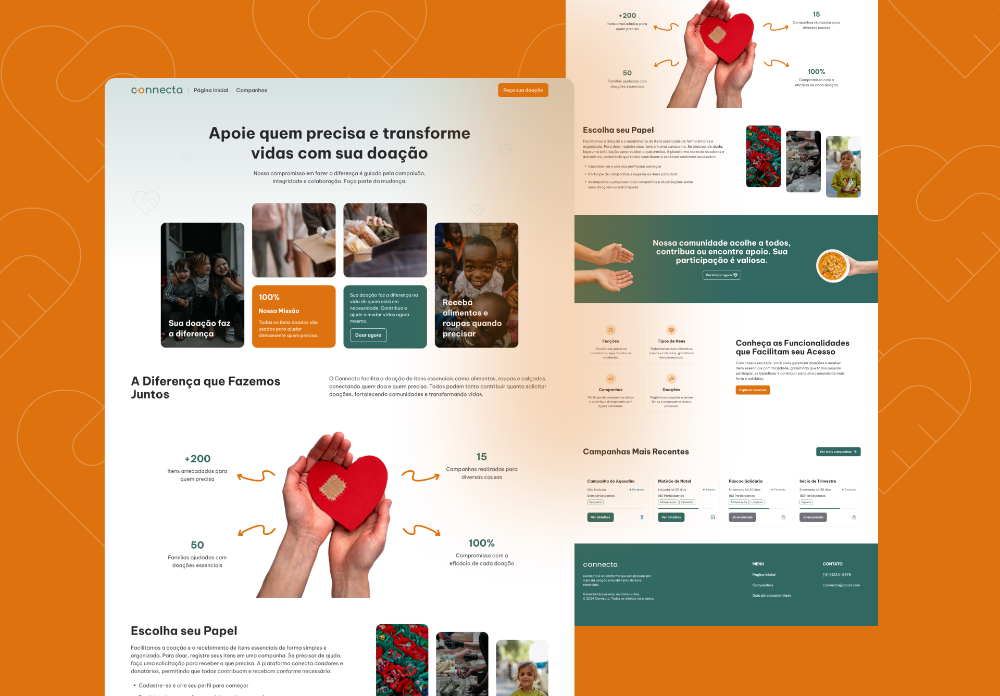

# Connecta

Plataforma desenvolvida para o controle de doações, conectando doadores e donatários por meio de uma aplicação web integrada. O sistema foi criado como parte do Projeto Interdisciplinar durante o 6º (último) semestre do curso de DSM na **Fatec Zona Leste**.

<div align="center">
    
</div>

## 📚 Sobre o Projeto

O **Connecta** foi idealizado para facilitar a gestão eficiente e organizada de doações em campanhas específicas. A plataforma é composta por uma parte pública para doadores e uma parte privada voltada para administradores. Seu objetivo é proporcionar uma experiência intuitiva e transparente para os envolvidos no processo de doação.

### 🔑 Funcionalidades Principais

#### Parte Pública
- **Acesso a Campanhas:** Visualização de campanhas abertas e futuras, mesmo sem cadastro.
- **Seleção e Reserva de Itens:** Doadores podem selecionar e reservar itens específicos para doação.
- **Perfil do Usuário:** Gestão de doações realizadas, participação em campanhas e envio de solicitação para se tornar donatário.

#### Parte Privada (Administrador)
- **Dashboard:** Visão geral com métricas e estatísticas.
- **Gestão de Campanhas:** Criação, edição, abertura e encerramento de campanhas.
- **Gestão de Doações:** Aprovação ou recusa de doações.
- **Gestão de Donatários:** Administração de solicitações, incluindo aprovação ou bloqueio de donatários.

## 💻 Acesse o Protótipo

O design foi criado com base em boas práticas de acessibilidade (WCAG) e responsividade *mobile-first*.

- [Protótipo no Figma](https://www.figma.com/design/RGEuELYn75cdRbMnAAFDPw/Connecta?node-id=3-337&t=ikcCapdI63AOxKxr-1)

## 🌐 Acesse o Projeto Online

- [https://connectaapp.vercel.app](https://connectaapp.vercel.app)

## 🚀 Tecnologias Utilizadas

O projeto foi desenvolvido utilizando as seguintes tecnologias principais:

### **Frontend**
- [Next.js](https://nextjs.org/) — Framework para aplicações React.
- [TypeScript](https://www.typescriptlang.org/) — Superset do JavaScript com tipagem estática.
- [TailwindCSS](https://tailwindcss.com/) — Framework de CSS utilitário para estilização rápida.
- [Radix UI](https://www.radix-ui.com/) — Componentes acessíveis e prontos para uso.
- [Zod](https://zod.dev/) — Biblioteca de validação e parsing de dados.
- [Sonner](https://sonner.dev/) — Sistema de notificações toast.

### **Backend**
- [Fastify](https://www.fastify.io/) — Framework rápido e eficiente para Node.js.
- [Fastify OAuth2](https://github.com/fastify/fastify-oauth2) — Integração com OAuth 2.0.
- [Firebase](https://firebase.google.com/docs/admin) — Gerenciamento de autenticação e serviços Firebase.
- [Zod](https://zod.dev/) — Validação e tipagem no backend.

## 🛠️ Como Executar o Projeto Localmente

### **Requisitos**
Certifique-se de ter instalado em sua máquina:
- [Git](https://git-scm.com)
- [Node.js](https://nodejs.org/en/)

### **Passos para o executar**
```bash
# Clone o projeto frontend
$ git clone https://github.com/mateussantanasilva/Connecta.git

# Acesse a pasta do projeto que desejar
$ cd Connecta/web ou Connecta/server

# Instale as dependências
$ npm install

# Execute o projeto
$ npm run dev
```